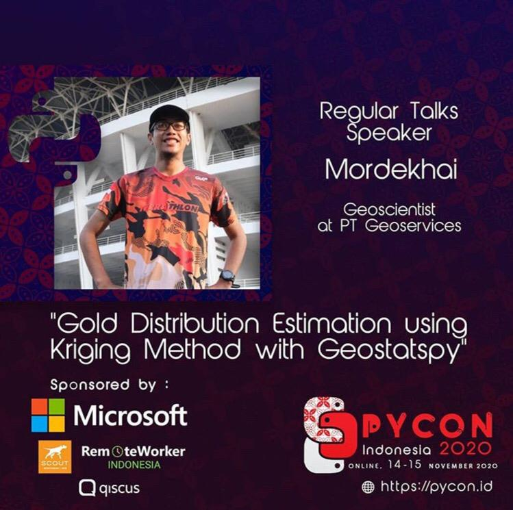

# Repository for my Regular Talk at Python Conference Indonesia 2020
## Title: Gold Distribution Estimation using Kriging Method with Geostatspy

###Link for the Recording at YouTube:
https://www.youtube.com/watch?v=zaaKHtGPX-E&list=PLIv0V1YCmEi3A6H6mdsoxh4RDpzvnJpMq&index=10&ab_channel=BandungPython

